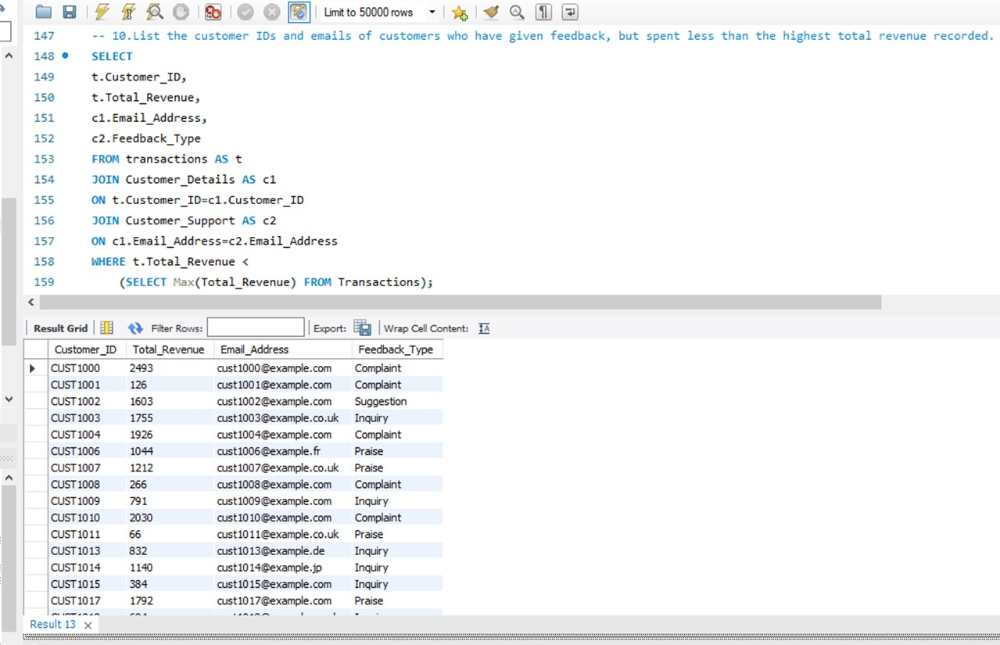

# 🛒 Super Store Sales – MySQL Project

## 📌 Project Overview
This project is built around a **Super Store Sales** dataset stored in MySQL.  
It demonstrates how to design relational tables, insert real-world style data, and run queries to extract valuable insights such as **customer behavior, sales performance, and satisfaction analysis**.

---

## 🗄️ Database & Table Creation
The SQL script creates a database named **`super_store_sales`** with the following schema:

- **Transactions**  
  - Stores purchase data: `Customer_ID`, `Product_Name`, `Unit_Price`, `Units_Sold`, `Discount_Applied`, `Total_Revenue`, `Date`, and `Payment_Method`.  
  - Acts as the core sales record table.  

- **Customer_Details**  
  - Contains customer demographics: `Customer_ID`, `Store_Location`, `Email_Address`, `Phone_Number`, `Membership_Tier`.  
  - Includes **unique constraints** on `Email_Address` and `Phone_Number`.  
  - Linked to `Transactions` via `Customer_ID` (foreign key).  

- **Customer_Support**  
  - Stores customer interactions: `Customer_ID`, `Email_Address`, `Feedback_Type`, and `Satisfaction_Rating`.  
  - Useful for analyzing **customer experience vs purchase behavior**.  


---

## 🔍 Queries & Insights

### 1. Retrieve All Customer Details
**Query Goal**: Selects all records from `customer_details`.  
**Insight**: Provides a complete view of customer demographics and membership tiers.  


---

### 2. Combine Transactions with Customer Details
**Query Goal**: Joins the `transactions` and `customer_details` tables.  
**Insight**: Links **sales performance with customer demographics** (e.g., which membership tier spends more).  


---

### 3. Calculate Revenue by Product Category
**Query Goal**: Aggregates total sales revenue grouped by product categories.  
**Insight**: Identifies top-performing categories for strategic sales decisions.  


---

### 4. Identify Customers Who Provided Feedback
**Query Goal**: Joins `transactions`, `customer_details`, and `customer_support`.  
**Insight**: Helps measure **customer engagement** and track which customer segments are more likely to give feedback.  


---

### 5. Customer Satisfaction vs Membership Tier
**Query Goal**: Retrieves satisfaction ratings and compares them across membership tiers.  
**Insight**: Reveals whether **Gold/Platinum members** report higher satisfaction compared to Bronze/Silver.  


---
### 6. Customers Who Gave Feedback
**Query Goal**: Joins `transactions`, `customer_details`, and `customer_support` to list customers who provided feedback, along with their product purchased and feedback type.  
**Insight**: Identifies active customers who engage with the company post-purchase.  


---

### 7. Top 5 Customers by Revenue with Membership & Satisfaction
**Query Goal**: Finds the top 5 highest-spending customers, including their membership tier and satisfaction rating from support records.  
**Insight**: Pinpoints **high-value customers** and checks if their satisfaction aligns with their spending.  


---

### 8. Electronics Buyers & Feedback Status
**Query Goal**: Extracts all customers who purchased products in the *Electronics* category, along with their contact info and resolution status of feedback.  
**Insight**: Useful for analyzing **after-sales service quality in the Electronics segment**.  


---

### 9. Customers with Above-Average Revenue
**Query Goal**: Uses a subquery to compare each customer’s revenue against the **average total revenue**. Returns only those above the mean.  
**Insight**: Segments **premium/high-value customers** for loyalty and retention campaigns.  


---

### 10. Feedback Customers Spending Less than Highest Revenue
**Query Goal**: Retrieves customers who gave feedback but whose total revenue is **less than the maximum revenue** recorded.  
**Insight**: Helps compare the **feedback patterns of mid-spending customers** with top spenders.  



## 📊 Potential Dashboards
Using the exported query results, dashboards can be created in **Excel, Power BI, or Tableau** for:
- Revenue trends by product category  
- Membership tier distribution  
- Feedback analysis linked to sales data  


## 🚀 How to Use
1. Import the SQL file into MySQL:
   ```sql
   SOURCE Super_Store_Sales.sql;
Run the included queries to explore insights.

Add query result screenshots in the images/ directory.

📂 Repository Structure
graphql
Copy code
├── Super_Store_Sales.sql       # SQL dump with schema, data, and queries
├── README.md                   # Project documentation
└── images/                     # Folder for query results & dashboard screenshots


##For collaboration,feedback or suggestions email me at shahidabbas2104514@gmail.com
